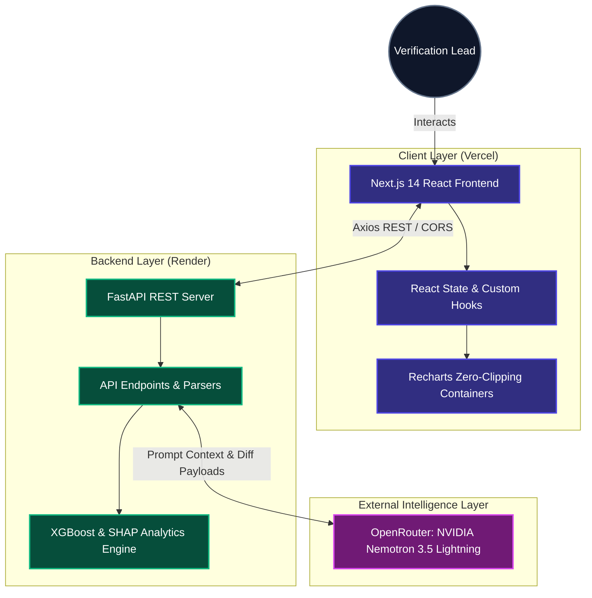

<div align="center">
  

  # ⚡ ConfigIntel
  **Autonomous Pre-Silicon Verification & Execution Log Analytics**

  [](https://nextjs.org/)
  [](https://fastapi.tiangolo.com/)
  [](https://xgboost.readthedocs.io/)
  [](https://openrouter.ai/)
  [](LICENSE)

  *Stop `grep`ping through millions of lines of UVM logs. Let AI isolate your silicon failures.*

  [Live Web App](https://configintel.vercel.app) • [Report Bug](https://github.com/ykwV/config-intelligence/issues) • [Request Feature](https://github.com/ykwV/config-intelligence/issues)
</div>

---

## 🌪️ The Verification Chaos (The Problem)

In highly randomized VLSI test environments (UVM, SystemVerilog, Emulation), hardware configurations are injected with massive variance:
- Randomized seed groups
- Dynamic cache replacement policies (LRU, FIFO, Random)
- Round-robin and priority task schedulers
- Feature flags, register toggles, and memory allocations

When a simulation fails or hangs, verifying whether it was a random transient anomaly or a deterministic parameter collision requires days of manual log tracing, waveform debugging, and cross-team escalation.

---

## 🎯 The ConfigIntel Solution

**ConfigIntel** is an enterprise-grade observability and explainability platform that ingests unstructured execution traces and multi-dimensional telemetry, transforming them into actionable root-cause intelligence.

By coupling **Gradient-Boosted Decision Trees (XGBoost)** and **SHAP (SHapley Additive exPlanations)** with **NVIDIA's Nemotron 3.5 Lightning (via OpenRouter)**, ConfigIntel answers the hardest questions in pre-silicon verification:

> **"Which exact parameter combination triggered this fatal failure, and what register fix will recover the regression suite?"**

---

## ✨ Core Intelligence Features

| Feature | Description |
| :--- | :--- |
| 🧠 **SHAP Risk Attribution** | Mathematically quantifies which exact parameter toggles (e.g., `Feature_Flag_X`, `Cache_Policy`) drive system failures vs. successes across thousands of runs. |
| 🤖 **Antigravity AI Copilot** | A context-aware, IDE-style copilot powered by NVIDIA Nemotron that synthesizes executive summaries and diagnoses root-cause mismatches in real-time. |
| ⚖️ **PPA Pareto Optimization** | Interactive 2D scatter profiling of Latency vs. Peak Memory to visually isolate the optimal hardware performance frontier. |
| 🧬 **Execution Divergence Analytics (Diffs)** | Select a PASS and FAIL run to instantly generate a state-mismatch table alongside synchronized side-by-side terminal log viewers. |
| 🎯 **ML Confidence Scoring** | Calculates $P(\text{FAIL} \mid X)$ utilizing XGBoost `predict_proba`, assigning a strict percentage-based mathematical certainty score to every execution. |
| 🕸️ **N×N Parameter Correlation Heatmap** | Interactive Pearson correlation matrix identifying hidden collinearities and coupling between randomized testbench parameters. |
| 📈 **Temporal Degradation Tracking** | Chronological time-series plotting of memory creep and latency degradation across regression cycles with dual Y-axis scaling. |

---

## 🏗️ Architecture & Pipeline

The system utilizes an asymmetric compute architecture. Heavy DataFrame processing, XGBoost model fitting, and SHAP tree-explainers run asynchronously on the Python backend, keeping the Next.js React client hyper-responsive.

### 1. Stack Topology



### 2. Data Telemetry Lifecycle

```mermaid
sequenceDiagram
    autonumber
    actor U as Verification Lead
    participant F as Next.js Dashboard
    participant B as FastAPI Backend
    participant M as XGBoost / SHAP Engine
    participant G as Nemotron AI API

    U->>F: Upload Telemetry (.csv) & Traces (.jsonl)
    F->>B: POST /api/ingest (multipart/form-data)
    rect rgb(15, 23, 42)
        Note over B, M: Machine Learning Execution
        B->>M: Parse datasets & aggregate runs
        M->>M: Train XGBoost Classifier
        M->>M: Compute SHAP & Confidence Scores
        M-->>B: Return processed analytical schemas
    end
    B-->>F: 200 OK (DashboardData JSON)
    F-->>U: Render KPI Cards & Interactive Charts
    U->>F: Click "✨ Auto-Analyze Diff in Copilot"
    F->>B: POST /api/copilot/chat
    rect rgb(30, 27, 75)
        Note over B, G: GenAI Synthesis
        B->>B: Inject Run parameters & failure metrics
        B->>G: Transmit engineered prompt to OpenRouter
        G-->>B: Stream synthesized hardware diagnosis
    end
    B-->>F: 200 OK (AI Response string)
    F-->>U: Display actionable intelligence in Copilot
```



---

## 🚀 Quick Start (Local Setup)

### Prerequisites
- **Node.js**: `18+`
- **Python**: `3.9` or `3.10+`
- An [OpenRouter API Key](https://openrouter.ai/) (NVIDIA Nemotron free tier supported)

---

### 1. Backend Setup (FastAPI)

```bash
# Clone the repository
git clone https://github.com/ykwV/config-intelligence.git
cd config-intelligence

# Create virtual environment and activate
python3 -m venv venv
source venv/bin/activate  # On Windows: venv\Scripts\activate

# Install Python dependencies
pip install -r requirements.txt

# Configure your OpenRouter API Key
echo "OPENROUTER_API_KEY=sk-or-v1-..." > .env

# Launch the FastAPI server
uvicorn main:app --host 0.0.0.0 --port 8000 --reload
```

The API docs will be available at [http://localhost:8000/docs](http://localhost:8000/docs).

---

### 2. Frontend Setup (Next.js)

```bash
# Open a new terminal and navigate to the frontend directory
cd frontend

# Install Node dependencies
npm install

# Configure backend API target
echo "NEXT_PUBLIC_API_URL=http://localhost:8000" > .env.local

# Run the Next.js development server
npm run dev
```

Navigate to [http://localhost:3000](http://localhost:3000). You can enter any username and password at the authentication gate to enter the workspace.

---

## 🧪 Verification & Analytics Testing

Validate the ML engine and endpoints locally:

```bash
# Validate ML engine and data integrity
python -c "
from analytics import ConfigAnalyticsEngine
e = ConfigAnalyticsEngine('execution_data_master.csv', 'system_execution_logs.jsonl')
print('Runs loaded:', len(e.df))
print('Top SHAP Drivers:', e.get_dashboard_data()['shap_metrics'][:3])
"

# Validate frontend production build
cd frontend && npm run build
```

---

## 👨‍💻 Authorship & Credits

**Architected and Developed by S. Varshith**  
Built for the future of Electronic Design Automation (EDA) and Autonomous Silicon Verification.

---

<div align="center">
  <sub>ConfigIntel • Accelerating Silicon Time-to-Market through Explainable AI</sub>
</div>
